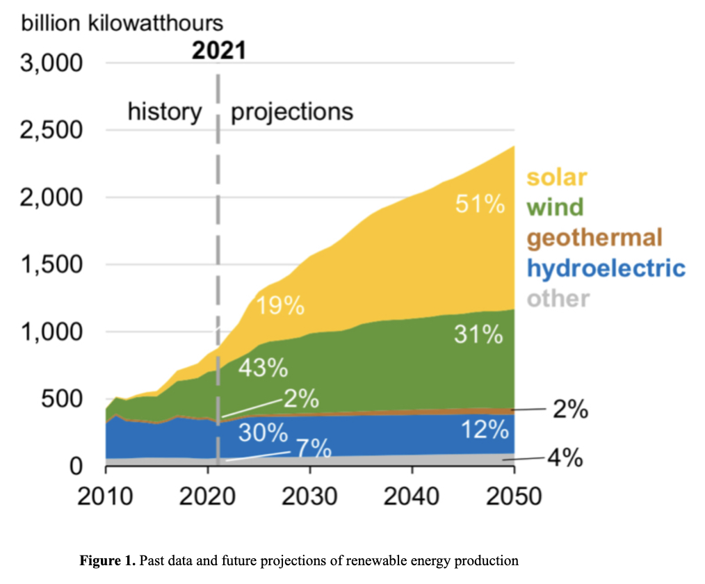
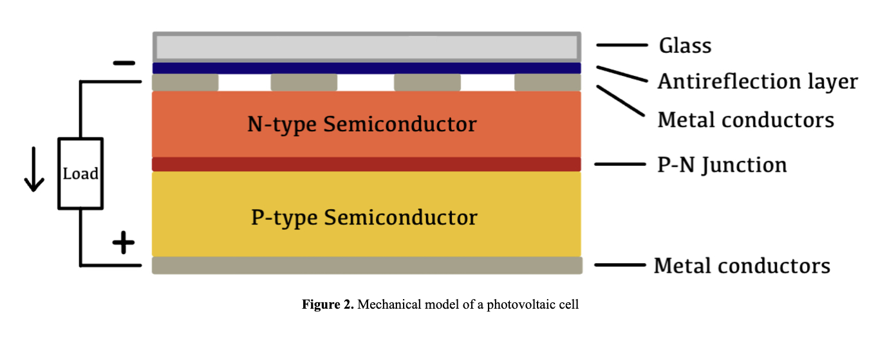
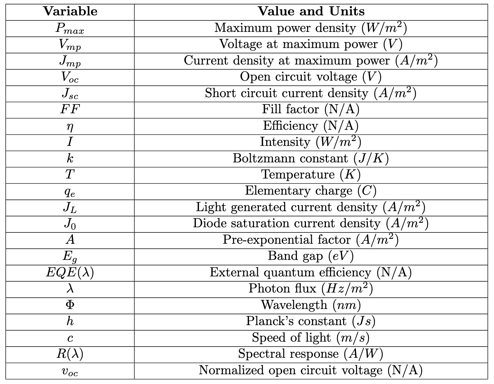
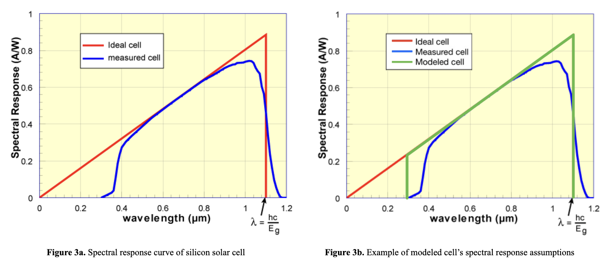
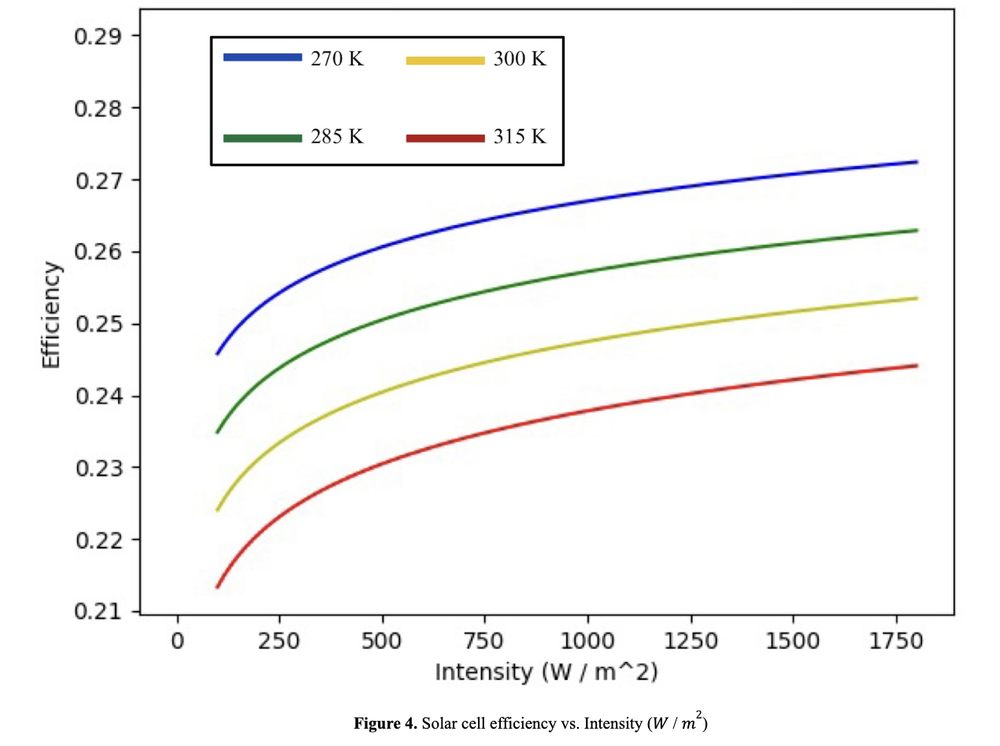
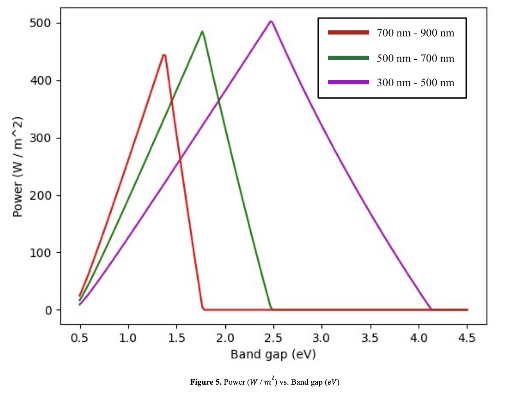
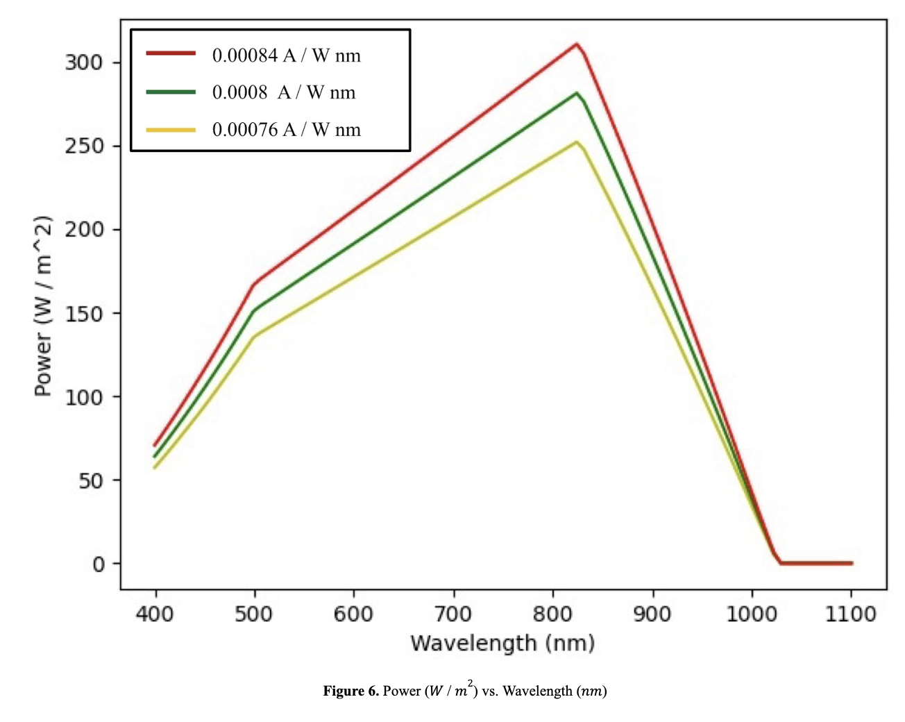

# Modeling Power Output and Efficiency of PV Cells

 ## Abstract
 
The current distribution of energy production reflects a heavy dependence on the non-renewable method of fossil fuel combustion. This over-reliance on an industry with significantly harmful environmental impacts has raised an immediate demand for alternative, renewable sources of energy production. Photovoltaic (PV) systems are the leading branch of renewable solar power and provide potential as a top energy source in this shift towards clean production methods. PV Systems are made up of arrays of photovoltaic cells which directly convert solar energy into electrical energy through the photoelectric effect of light. This paper serves to measure and analyze how variation of parameters (temperature, spectral response, band gap, etc.) in crystalline photovoltaic cells can be utilized to maximize power output efficiency. The approach taken to answer this question of maximized efficiency has been to program a model of a photovoltaic cell using fundamental physics equations, which allows for variation of both internal and external properties. The methodology of the program as well as an explanation for each modeled equation are detailed throughout the paper. Through data visualization and analysis of the program’s results, relevant information can be collected regarding optimization of photovoltaic cells to lead the charge towards renewable energy systems and a more sustainable world environment. Visualizations are presented along with discussion that connects the model’s results to the underlying physics of PV cells.

 ## Background
 
Burning fossil fuels as a means of energy generation is responsible for a vast majority of greenhouse gas emissions, which are the current leading cause of global warming. The U.S. Energy Information Administration reports fossil fuel combustion as the cause for 73% of greenhouse gases released in the United States (U.S. Energy Information Administration, 2022). Concentration of these greenhouse gases has been on an exponential rise since the industrial revolution, bringing concern for the growing levels of heat trapped within our atmosphere (Allen et al., 2019). Furthermore, fossil fuel combustion is the leading source of air pollution in the United States. Environmental research conducted by Harvard University even reveals that pollution from fossil fuels is responsible for nearly 1 in 5 deaths worldwide (Fossil fuel air pollution, 2021).

Overuse of fossil fuels in energy production has led to numerous efforts in providing renewable, clean sources of energy. These efforts have led to an exponential increase in implementation of renewables in recent years. However, this worldwide shift towards clean energy has greatly increased demand for research amongst these fields of energy generation. Figure 1 shows projections for the future distribution of renewable energy systems. Solar is shown with potential to expand from 19% to over half of the total share of renewable electricity generation throughout the United States. Photovoltaics are the leading branch of solar technology and are advantageous over other energy sources in both their ability to easily scale and their utilization of the near infinite energy supply provided by the sun. MIT research shows that the sun provides enough energy to the earth’s surface to supply the world’s energy needs 10,000 times over, giving photovoltaic (PV) means of energy collection the potential to expand nearly indefinitely: the remaining challenge is maximizing the efficiency of the energy production process (Chandler, 2011).

  ## Introduction 
  
This paper is meant to provide further analysis to a computer program written to model power output and efficiency of a PV cell under various internal and external conditions. Results from the program can be used to analyze and display how efficiency of PV cells may be optimized, providing conclusions to assist the growth of solar systems within the field of energy production.

Figure 2 shows a basic model of the layers that make up a photovoltaic cell. A layer of glass covers the top, followed by an antireflective coating. The purpose of the antireflective coating is for the cell to capture as many photons as possible into the cell’s semiconductors. The antireflection layer utilizes destructive interference between the light waves reflected off of the top and bottom side of the material (Bowden & Honsberg, 2019a). The wave reflected from the bottom is almost exactly a negative displacement of the wave reflected from the top, meaning essentially no photons are reflected outside of the silicon cell (Bowden & Honsberg, 2019a). This coating is essential and can reduce the reflected photons from about 10-30% reflection of incoming light down to nearly 3% (Bowden & Honsberg, 2019a; Sarkın et al., 2020). 
The photons that are not reflected off of the cell’s top collide with the N-type semiconductor material. Through the photoelectric effect, some photons can strike the cell with enough energy to knock electrons off of the N-type material. These electrons then flow to the P-type material. This flow of charge forms a gradient which is the basis of electricity generation within a solar cell. To allow for the flow of electrons from the N-type to P-type semiconductors, N-type material is usually doped with phosphorus atoms (more valence electrons than semiconductor material) and P-type material is usually doped with boron atoms (less valence electrons than semiconductor material). Metal conductors are placed on both the top and bottom of the semiconductors to mediate the transfer of electrons and carry charge; however, the top portion of the cell contains a grid of conductors (rather than a full plate) to minimize the conductors’ interference with incoming photons.

  ## Physics of Photovoltaic Cell Efficiency
  
The fundamental physics behind power production of a PV cell can be modeled through equations using a first principles approach. However, use of fundamental equations requires a sufficient understanding of the parameters that affect power output. Below is a list of the main parameters whose variations alter the power output and efficiency of a PV cell.

   ### Material 
 
Impurities in the material of the P and N type semiconductors prevent many of the electrons (released through the photoelectric effect) from flowing to the metal conductors and through the P-N Junction. If the material of the P and N type semiconductors is more pure, electrons will be much more likely to flow through the cell and generate a current. 
  
   ### Reflection
   
Even with the addition of an antireflective coating to a solar cell, a significant portion of photons that strike the cell are reflected either by the initial layer of glass or off of the semiconductor material. Any photons that are reflected off of the cell are unable to release electrons and generate current, which leads to a loss in the cell’s efficiency.
  
   ### Band gap
   
The band gap of the semiconductor is the minimum energy required from incoming photons to excite an electron from the valence band to the conduction band of the P or N type material. The transfer of an electron to this more energetic state produces a charge. Any photon that strikes the N-type semiconductor with energy below the band gap does not release an electron and contributes no electrical energy to the circuit. A photon with energy above the cell’s band gap is able to knock an electron off of the N-type material, but that photon is only able to contribute electrical energy equal in magnitude to the band gap. Any excess energy from these limitations is re-emitted as light or in the form of heat.

   ### Temperature

The internal temperature of semiconductor material in the P-N junction is essential in the process of releasing electrons to generate current. As temperature increases, electrons of the N-type material have more energy, and less energy is required to transfer them into the conduction band (Singh & Ravindra, 2012). This increase in electron energy allows for holes to be generated in the N-type semiconductor and electrons to be generated in the P-type semiconductor (minority charge carriers) through a process called thermal excitation (Dubey et al., 2013; Singh & Ravindra, 2012). Generation of these minority charge carriers results in a decreased voltage difference across the cell.

   ### Angle

The intensity of light striking a PV cell can be represented as a vector whose angle depends on the relation between the sun’s radiation and the cell’s tilt. However, the incident power that the cell receives is equal only to the component of the intensity vector perpendicular to the surface of the cell (George & Anto, 2012). To maximize incident power, PV cells are often tilted to an angle 90° from the sun’s radiation. The ideal tilt of a cell depends on both its latitude and the season (George & Anto, 2012).

   ### Intensity of light

Perhaps the most essential factor to a solar cell’s power output is the intensity of light that reaches the cell. This intensity can be defined as the magnitude of power striking the cell, which is dependent upon photon flux and wavelength of incoming light.

   ### Interference of conductor material

As shown in Figure 2, a grid of metal conductors exists above the N-type semiconductor material in a standard PV cell. If photons strike this conductor material, rather than the semiconductor material, they are unable to excite electrons. In this case, energy is lost as heat or re-emitted light. Smaller conductors are often used in the top portion of a cell to minimize the shading of N-type semiconductors; however the use of smaller conductors introduces a trade-off of an increased internal resistance. Because the effects of conductor interference on a PV cell are minimal and roughly constant, regardless of environmental factors and semiconductor material, they are not considered in this model. 
 
  ## Nomenclature

Table 1 contains a full list of variables and constants along with units that are referenced throughout this work. 

  ## Programmed Model and Methodology
  
To provide reliable and beneficial data, the program implements both fundamental physics equations and values acquired from previous research and experimentation. However, as with any computer generated model, assumptions are made of the cell’s behavior and conditions that limit the scope of conclusions drawn from results. These assumptions are detailed throughout the following analysis of the program’s methodology. The discussion of results provides further insight into how data can be interpreted with consideration of these assumptions. Furthermore, the python code used to create the model is included below the list of references.

   ### Power
   
The PV model was developed on the basis of a standard equation for maximum power density Pmax. The model provides power output as a density (with units W / m2) to allow for relevant results regardless of cell area.

Pmax = Vmp *  Jmp (1)
Pmax = Voc * Jsc * FF (2)

This value is calculated in Equation (2) from the cell’s open circuit voltage  Voc, short circuit current density  Jsc, and fill factor FF, where fill factor is a ratio of power at  Voc and   Jsc  to maximum power and represents the fraction of the cell’s power production when compared to its theoretical maximum.

η = Pmax/Pin = Pmax/I (3)

Efficiency η can then be calculated in Equation (3) from the power density of the cell through simply dividing by incident power, or intensity.

   ### Open Circuit Voltage
   
The open circuit voltage Voc is the potential difference across the cell when current is zero. It is a representation of the amount of electron-hole pairs present in a P-N junction of a PV cell.

Voc = ((k * T) / q) * ((JL/ J0) + 1) (4)

According to Equation (4), the open circuit voltage is dependent upon temperature T, light generated current density JL , and diode saturation current density J0 (Singh & Ravindra, 2012). The calculation of light generated current density implemented within the programmed model contains the assumption that JL is equivalent to  Jsc . This assumption has a minimal effect on calculation of open circuit voltage as long as the series resistance of the cell does not greatly exceed standard levels (Bowden & Honsberg, 2019b). 

   ### Diode Saturation Current Density
   
The diode saturation current density J0 is a measurement of the cell’s current when treated as a reverse biased diode, meaning the N-type semiconductor is treated as the positive terminal and the P-type semiconductor is treated as the negative terminal. When in reverse bias, the current that flows through the P-N junction is due to minority charge carriers that are thermally generated. This thermal excitation of minority carriers is a result of lattice vibrations that can excite electrons into the conduction band, creating a charge.

J0 = A * exp(-Eg / (k * T)) (5)

Equation (5) takes the form of an Arrhenius expression and reflects saturation current  J0 depending upon material independent constant A, internal temperature T, and band gap Eg  (Ravindra & Prasad, 1980; see also Singh & Ravindra, 2012). Research from the University of Roorkee in India has shown this constant A to be independent of semiconductor material and equal to 2.95*105 (with units A / cm2) (Ravindra & Prasad, 1980). The reason for the saturation current’s heavy dependence on the internal temperature is that with increased temperature, there will be a greater frequency of lattice vibrations, increasing the likelihood of electron excitation and generation of minority carriers (Cheong et al., 2018). The effect of band gap on saturation current is because a higher band gap will require greater energy to transfer electrons into the conduction band and generate saturation current (Cheong et al., 2018). A greater energy requirement will then lead to a decrease in saturation current due to a decreased probability of electrons being thermally excited.

   ### Short Circuit Current Density

Short circuit current density Jsc is the density of current running through the P-N junction of a PV cell when voltage is zero. Its value is the rate of majority charge carriers passing a certain point in the P-N junction.

Jsc = q * Integral(λ1, λ2) EQE(λ) * Φ * dλ (6)

Jsc can be calculated using Equation (6) through an integration over a range of wavelengths spanning from λ1 to λ2. The external quantum efficiency EQE(λ) (ratio of collected charge carriers to incoming photons at a certain photon wavelength λ) is then multiplied by photon flux Φ (photons per second per unit area) to achieve the generation rate of charge carriers.  

EQE() = ((h * c) / (q * λ)) * R(λ) (7)

Φ = (I * λ) / (h * c) (8)

Jsc = Integral(λ1, λ2) R(λ) * I * dλ (9)

However, solving for external quantum efficiency EQE(λ) and photon flux Φ in Equation (6) yields the simpler Equation (9) (Samavati et al., 2018; Amillo et al., 2015). Here, short circuit current is represented as an integral of spectral response R(λ) multiplied by incoming light intensity I. The above equation provides units A / m, whereas the ideal units of Jsc for implementation in the model would be A / m2. To account for this and maintain an accurate short circuit current density, the model utilizes the average value of this function rather than the integration of it.

Jsc = (1 / (λ1 - λ2)) * Integral(λ1, λ2) R(λ) * I * dλ (10)

Equation (10) is included in the model and makes the assumption that every wavelength of light from 1 to 2 strikes the cell and is equal in abundance to every other wavelength in that range.

   ### Spectral Response
   
Spectral response R(λ) is the ratio of the cell’s generated current to incident power striking the cell (with units  A / W) (Amillo et al., 2015). It is completely dependent upon semiconductor material properties (such as band gap) as well as the wavelength of light striking the material (Amillo et al., 2015). 	

Figure 3a gives an example of a spectral response curve for a silicon PV cell. As with any spectral response curve, the measured cell’s response begins at wavelength 300 nm and trends upwards until the band gap of the semiconductor material is reached (Bowden & Honsberg, 2019c; see also Amillo et al., 2015). In this case, the band gap lies at 1100 nm, so the spectral response declines to 0 A / W at that wavelength. The spectral response’s drop at the bandgap is due to the fact that any photon with energy below the bandgap will not generate current within the cell (and wavelength is inversely proportional to photon energy).

As depicted in Figure 3b, the programmed model implements a spectral response graph similar to that of an ideal cell; however, the modeled spectral response begins at wavelength 300 nm to reflect values more accurate to those in the measured cell. Given the ideal cell’s slope and band gap cut off, the program constructs a trapezoid-like graph similar to that shown in the green graph of Figure 3b. The model was developed to allow for variation of the top right point of this trapezoid. Moving this point to the left or right would represent a change in the material’s band gap and the graph’s x-intercept, while moving this point up or down would represent a change in the material’s spectral response and the graph’s slope. This potential for variation introduces the ability to model and compare results of PV cells of any material with sufficient internal properties. 

   ### Fill Factor 

Although fill factor varies in each individual PV cell, its value can be approximated as a function of open circuit voltage Voc. 

FF = (voc - ln(voc + 0.72)) / (voc + 1) (11)

voc = Voc * (q / (k * T)) (12)

Equation (11) above was proposed by photovoltaics engineer Martin Green as an approximation of fill factor FF; however, this method of approximating the fill factor assumes zero series resistance and infinite shunt resistance (Green, 1982; Leilaeioun & Holman, 2016). Due to this limitation, the model does not consider resistance as a variable parameter in calculation of power density. Furthermore, the model’s implementation of this equation assumes that the fill factor is ideal for any given open circuit voltage Voc , which provides slightly inflated values of power density (Green, 1982; Leilaeioun & Holman, 2016). However, since fill factor does not directly affect open circuit voltage Voc or short circuit current  Jsc , the trends shown by resulting data remain valid.

  ## Results and Discussion

The following analysis of the model’s results presents numerous graphs of varied parameters along with outcomes in power and cell efficiency. Each graph is accompanied by an explanation of potential reasoning for the shown results as well implications to be drawn from the visualization. Unless otherwise stated, external conditions are set to a standard of 800 W / m2 light intensity, 300 K temperature, and a tilt angle perpendicular to incoming sunlight.

   ### Cell efficiency vs. intensity at multiple internal temperatures

The graph in Figure 4 reflects a trend of increased cell efficiency percentages at higher intensities of incoming light. As more photons strike the cell, the semiconductor material is able to convert a greater portion of those photons into charge carriers. However, as intensity increases, the increase in efficiency occurs at a lower rate.

   ### Power vs. band gap at multiple wavelength ranges

The graph shown in Figure 5 displays the correlation between band gap and power density. In each case, power increases with band gap until the band gap reaches the value that corresponds to the given wavelength range. For example, the wavelength range 700 nm - 900 nm corresponds to 1.38 eV - 1.77 eV when converted to photon energy. This is reflected by the red colored data presented by the graph as the power begins its decline at 1.38 eV and strikes 0 W / m2 at 1.77 eV. 
As light wavelength decreases, power graphs are able to reach higher peaks, and these peaks occur at greater band gap values. A lower band gap is more ideal for light of greater wavelength due to the lower energy contained in those photons. For photons striking the cell with less energy, it is essential to decrease the band gap to allow the incident light to excite electrons. Conversely, a higher band gap is more ideal for light of lesser wavelength because incoming photons will have more energy, and an increased band gap allows for more of that energy to be captured in the form of electricity.

   ### Power vs wavelength at multiple spectral response slopes

The above graph in Figure 6 displays the effect that wavelength has on power density at various spectral response curves. Wavelengths are input into the model as a range at a given x-coordinate x1 on the graph from x1 - 200 nm to x1. The band gap in this test case is set to 1.5 eV, which corresponds to a wavelength of 827 nm. The graph reflects this band gap, as 827 nm is the point at which power begins its decline. As the slope of each spectral response curve increases, the power density is able to reach higher peaks. This occurrence is the result of a greater portion of incoming photons being able to excite charge carriers. 
Figure 6 also presents the significance of light wavelength on magnitude of power density. At smaller wavelengths such as 400 nm, power only reaches about 20% of its potential peak. Small wavelengths are much less efficient in this model because the energy at those wavelengths is far above the band gap of the semiconductor material (1.5 eV in this case). The incoming photons have enough energy to excite electrons, but the excess energy that they hold is re-emitted as light or heat and unable to produce electrical energy.

  ## Conclusion

Results of the programmed photovoltaic model have been displayed along with analysis of various graphs and relationships. The presented research reflects the importance of material research and development in the fields of semiconductors and solar cells. Results have shown that the ideal band gap in semiconductor material is strongly dependent upon the wavelengths of light which strike the cell in a given case. Depending on the location of a cell, this correlation could vary the material property needs and could require materials of various band gaps. The strong dependence of material properties on external conditions has been the basis for extensive research into developing multi-junction PV cells that have multiple band gaps. Additionally, the process of combining materials has been essential in producing cells with ideal internal properties. To further progress the implementation of photovoltaics as a renewable energy source, it is essential to match material properties of each cell in a way that maximizes efficiency depending upon external parameters of the cell’s location.

  ## References
  
Allen, S. A., Ree, A. G., Ayodeji, S. A., Deborah, S. A., & Ejike, O. M. (2019). Secondary Inorganic Aerosols: Impacts on the global climate system and human health. Biodiversity International Journal, 3(6), 249–259. https://doi.org/10.15406/bij.2019.03.00152 
Amillo, A., Huld, T., Vourlioti, P., Müller, R., & Norton, M. (2015). Application of satellite-based spectrally-resolved solar radiation data to PV Performance Studies. Energies, 8(5), 3455–3488. https://doi.org/10.3390/en8053455 
Bowden, S. G., & Honsberg, C. B. (2019). Anti-reflection coatings. PVEducation. https://www.pveducation.org/pvcdrom/design-of-silicon-cells/anti-reflection-coatings 
Bowden, S. G., & Honsberg, C. B. (2019). Short-circuit current. PVEducation. https://www.pveducation.org/pvcdrom/solar-cell-operation/short-circuit-current 
Bowden, S. G., & Honsberg, C. B. (2019). Spectral response. PVEducation. Retrieved from https://www.pveducation.org/pvcdrom/solar-cell-operation/spectral-response 
Chandler, D. L. (2011, October 26). Shining brightly. MIT News | Massachusetts Institute of Technology. https://news.mit.edu/2011/energy-scale-part3-1026 
Cheong, K. Y., Impellizzeri, G., & Fraga, M. A. (2018). Emerging materials for energy conversion and storage. Elsevier. 
Dubey, S., Sarvaiya, J. N., & Seshadri, B. (2013). Temperature dependent photovoltaic (PV) efficiency and its effect on PV production in the World – A Review. Energy Procedia, 33, 311–321. https://doi.org/10.1016/j.egypro.2013.05.072 
Fossil fuel air pollution responsible for 1 in 5 deaths worldwide. C-CHANGE | Harvard T.H. Chan School of Public Health. (2021, February 9). https://www.hsph.harvard.edu/c-change/news/fossil-fuel-air-pollution-responsible-for-1-in-5-deaths-worldwide/ 
George, A., & Anto, R. (2012). Analytical and experimental analysis of optimal tilt angle of Solar Photovoltaic Systems. 2012 International Conference on Green Technologies (ICGT). https://doi.org/10.1109/icgt.2012.6477978 
Green, M. A. (1982). Accuracy of analytical expressions for solar cell fill factors. Solar Cells, 7(3), 337–340. https://doi.org/10.1016/0379-6787(82)90057-6 
Leilaeioun, M., & Holman, Z. C. (2016, September 28). Accuracy of expressions for the fill factor of a solar cell in terms of open-circuit voltage and ideality factor. AIP Publishing. Retrieved from https://aip.scitation.org/doi/10.1063/1.4962511 
Ravindra, N. M., & Prasad, B. (1980). Saturation current in solar cells: An analysis. Solar Cells, 2(2), 109–113. https://doi.org/10.1016/0379-6787(80)90004-6 
Samavati, A., Samavati, Z., Ismail, A. F., Othman, M. H., Rahman, M. A., & Amiri, I. S. (2018). Effect of organic ligand-decorated zno nanoparticles as a cathode buffer layer on electricity conversion efficiency of an inverted solar cell. RSC Advances, 8(3), 1418–1426. https://doi.org/10.1039/c7ra11902j 
Sarkın, A. S., Ekren, N., & Sağlam, Ş. (2020). A review of anti-reflection and self-cleaning coatings on photovoltaic panels. Solar Energy, 199, 63–73. https://doi.org/10.1016/j.solener.2020.01.084 
Singh, P., & Ravindra, N. M. (2012). Temperature dependence of solar cell performance—an analysis. Solar Energy Materials and Solar Cells, 101, 36–45. https://doi.org/10.1016/j.solmat.2012.02.019 
U.S. Energy Information Administration - EIA - independent statistics and analysis. Where greenhouse                                         gases come from - U.S. Energy Information Administration (EIA). (2022, June 24).  https://www.eia.gov/energyexplained/energy-and-the-environment/where-greenhouse-gases-come-from.php 
